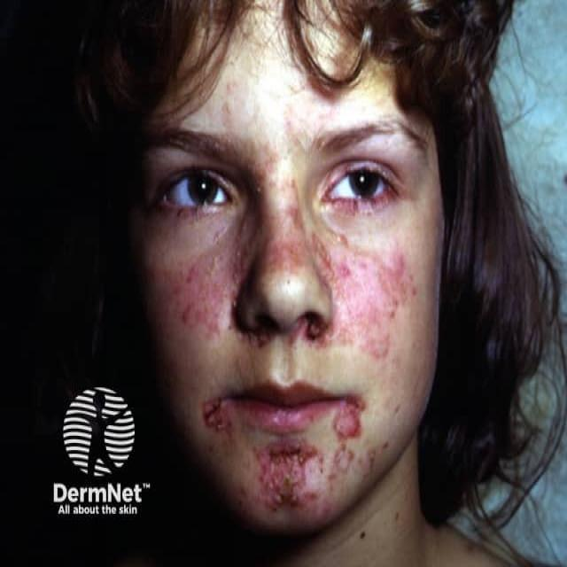
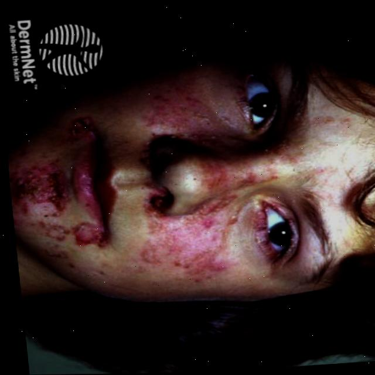
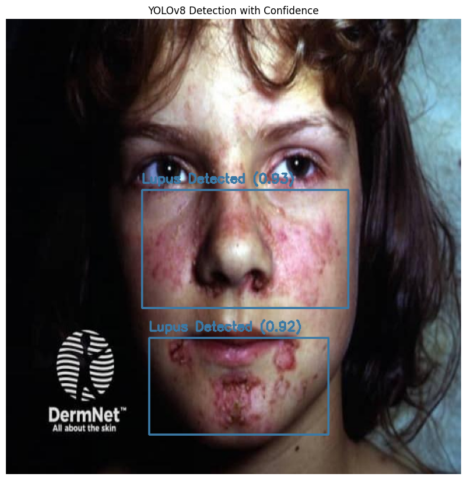
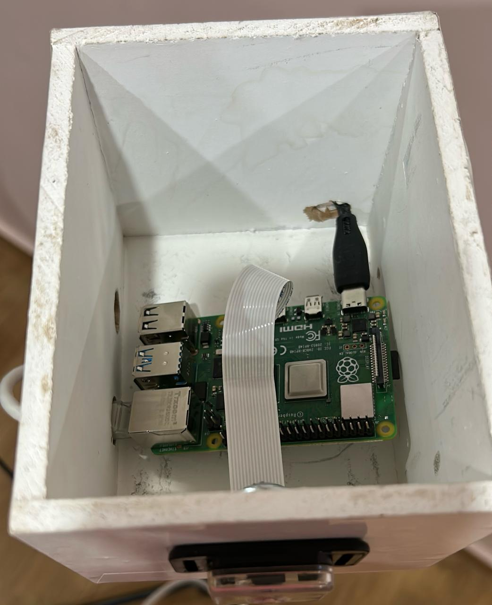
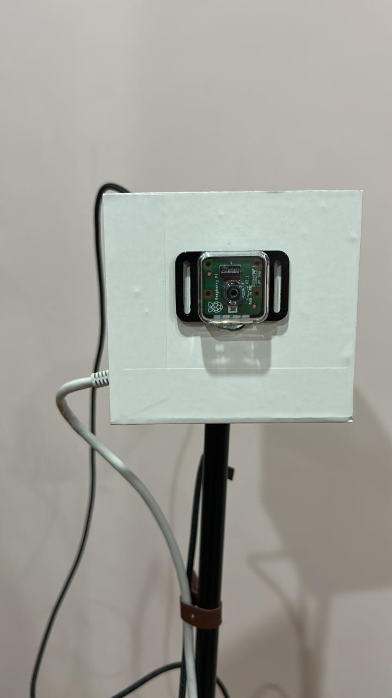

# 🦋 LupiScan

## About

***An AI-powered embedded system for real-time detection of Lupus Butterfly Rash using Computer Vision and Deep Learning.***

LupiScan is designed to support the early screening of **Systemic Lupus Erythematosus (SLE)** by detecting the characteristic butterfly-shaped facial rash from live camera input. The project combines **YOLOv8 object detection**, **OpenCV image processing**, and **Raspberry Pi deployment** to provide a portable, low-cost, and efficient diagnostic support solution.

**The system can:**

* Detect lupus butterfly rash in facial images.
* Perform real-time inference using a live camera feed.
* Run efficiently on a Raspberry Pi 4.
* Support early medical screening and awareness.
* Demonstrate practical deployment of AI in healthcare applications.

---

## Tech Stack

* **Programming Language:** Python
* **Deep Learning:** YOLOv8 (Ultralytics)
* **Computer Vision:** OpenCV
* **Dataset Management:** Roboflow
* **Embedded Hardware:** Raspberry Pi 4
* **Version Control:** Git & GitHub

---

## Installation

### Prerequisites

Make sure you have **Python 3.8+** installed on your system.

### Required Dependencies

The project requires the following Python packages:

```python
import cv2          # OpenCV - Computer Vision
import numpy as np  # NumPy - Numerical Processing
import subprocess   # Standard Library - No installation needed
from ultralytics import YOLO  # YOLOv8 Object Detection
```

### Install Packages

Run the following command to install all required packages at once:

```bash
pip install opencv-python numpy ultralytics
```

Or install them individually:

```bash
pip install opencv-python   # OpenCV for image processing
pip install numpy           # NumPy for numerical operations
pip install ultralytics     # YOLOv8 by Ultralytics
```

> **Note:** `subprocess` is part of Python's standard library and does **not** require installation.

### For Raspberry Pi

If you are deploying on a Raspberry Pi, use the following instead of `opencv-python`:

```bash
pip install opencv-python-headless numpy ultralytics
```

> `opencv-python-headless` is recommended for embedded/server environments where a display is not available.

---

## Project Workflow

### 1. Dataset Collection

The initial dataset consisted of:

* 106 facial images showing lupus butterfly rash.
* Images collected from publicly available dermatology resources, including DermNet.

### 2. Data Augmentation

To improve model generalization and performance, augmentation was performed using Roboflow.

**Techniques used:**

* Rotation
* Scaling
* Illumination Adjustment

**Dataset expansion:**

* Original Images: 106
* Augmented Images: 610

### 3. Data Annotation

* Manual annotation using bounding boxes.
* Rash-affected facial regions labeled for object detection.
* Quality checks performed to ensure accurate localization.

### 4. Model Training

Several object detection models were evaluated:

* YOLOv8
* YOLOv11
* RF-DETR

Models were compared based on:

* Detection accuracy
* Inference speed
* Training complexity
* Deployment efficiency

After evaluation, **YOLOv8** was selected as the final model due to its balance between speed, accuracy, and resource requirements.

### 5. Deployment

The trained model was deployed on:

* Raspberry Pi 4
* OpenCV Camera Stream

This enables real-time detection directly on edge hardware without requiring cloud processing.

---

## System Architecture

```text
Camera Input
      │
      ▼
OpenCV Processing
      │
      ▼
YOLOv8 Detection Model
      │
      ▼
Butterfly Rash Detection
      │
      ▼
Real-Time Output
      │
      ▼
Raspberry Pi 4
```

---

## Model Performance

| Metric | Result |
|----------|----------|
| mAP | 84.2% |
| Precision | 91.4% |
| Recall | 73.2% |

### Performance Analysis

* High precision indicates a low false-positive rate.
* Good recall demonstrates the model's ability to identify most lupus rash cases.
* Data augmentation significantly improved validation performance and model robustness.

---

## Why YOLOv8?

* Real-time object detection capabilities.
* Lightweight enough for Raspberry Pi deployment.
* High detection accuracy.
* Efficient single-stage architecture.
* Strong performance under varying image conditions.

---

## Challenges and Solutions

### Limited Dataset Availability

**Challenge:**

Obtaining sufficient labeled images of lupus butterfly rash was difficult.

**Solution:**

Applied extensive data augmentation techniques using Roboflow to increase dataset diversity and improve model generalization.

### Embedded Hardware Constraints

**Challenge:**

Running deep learning models efficiently on Raspberry Pi hardware.

**Solution:**

Evaluated multiple detection models and selected YOLOv8 due to its lightweight architecture and fast inference speed.

### Environmental Variability

**Challenge:**

Detection performance may decrease under poor lighting conditions or extreme camera angles.

**Solution:**

Applied augmentation techniques that simulate real-world conditions to improve model robustness.

---

## Limitations

* Limited number of original lupus facial images.
* Performance may decrease in poor lighting conditions.
* Sensitive to extreme facial orientations.
* Designed specifically for butterfly rash detection and not for diagnosing all lupus manifestations.
* Intended as a screening support tool rather than a medical diagnosis system.

---

## Future Features / Stretch Goals

* Expand the dataset with greater diversity in:
  * Age groups
  * Skin tones
  * Disease stages

* Develop a mobile application for:
  * Displaying detection results
  * Managing user information
  * Supporting healthcare system integration

* Integrate additional diagnostic indicators:
  * Symptoms
  * Medical history
  * Other skin manifestations

* Add telemedicine support for remote physician review.

* Optimize inference using:
  * TensorFlow 
  * Hardware accelerators
  * More efficient edge AI solutions

---

## Demo Screenshots

### Dataset Samples



### Augmentation Examples



### Real-Time Detection



### Hardware Design - Raspberry Pi 4 Model B



### Hardware Design - Raspberry Pi Camera Module



---

## Version Control

* Hosted on **GitHub**.
* Managed using **Git** version control.
* Meaningful commits used throughout development.
* Development progress documented through repository history.

---

## Supervisor

**Prof. AbdelIlah Nour Alshbatat**

---

## Team Members

* Rama Ahmad AlJufout
* Nour Hatim AlHloul

---

## Author

**Rama Ahmad AlJufout**

📧 Email: aljufoutrama@gmail.com

🔗 GitHub: https://github.com/Rama-AlJufaut

---

## Disclaimer

This project was developed for educational and research purposes only. LupiScan is not intended to replace professional medical diagnosis, treatment, or consultation. Any medical concerns should be evaluated by qualified healthcare professionals.